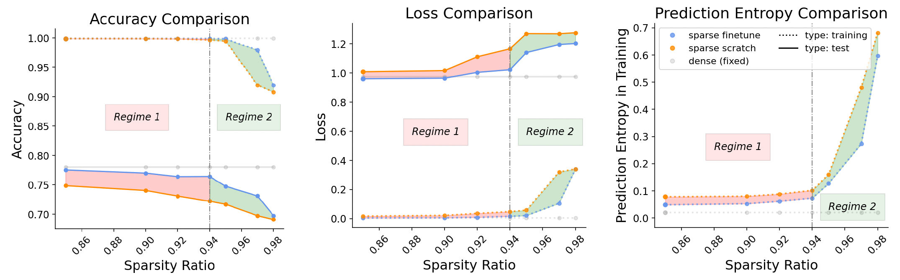

# Generalization and Memorization in Sparse Neural Networks
   

This is the repository for our [paper](https://github.com/ZIYU-DEEP/Generalization-and-Memorization-in-Sparse-Training/blob/main/paper.pdf) ([poster](https://github.com/ZIYU-DEEP/Generalization-and-Memorization-in-Sparse-Training/blob/main/Poster.pdf)) on "***The Price of Sparsity: Generalization and Memorization in Sparse Neural Networks***", presented at the [Sparsity in Neural Networks Workshop](https://www.sparseneural.net/) (virtual + ICML meetup, July 13th 2022). 

We will archive our paper and poster here, and release the code (in PyTorch and Jax) upon the finalization of the research project. In the meantime, if you would like to request any code or instruction to reimplement our experiments, please do not hesitate to contact me at ziyuye@uchicago.edu or ziyuye@live.com.
